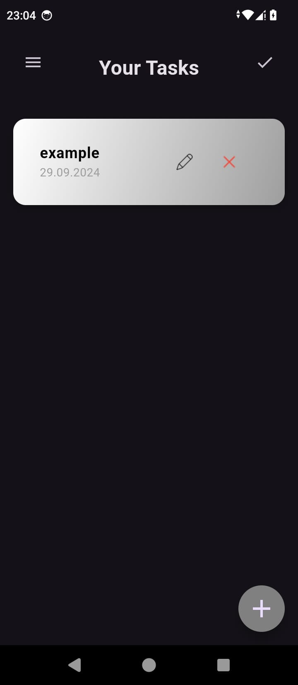

# Serenity Tasks

**Serenity Tasks** ist eine benutzerfreundliche Aufgabenverwaltungs-App, die dir hilft, deine täglichen Aufgaben effizient zu organisieren und zu erledigen. Die App ist für iOS und Android verfügbar und bietet zahlreiche Funktionen zur Verbesserung deiner Produktivität.

## 📱 Funktionen

- **Benutzerregistrierung und Authentifizierung:** Sichere Anmeldung für personalisierten Zugriff.
- **Profilbild-Auswahl:** Benutzer können bei der Registrierung ein Profilbild hochladen.
- **Aufgabenmanagement:** Erstelle, bearbeite und lösche Aufgaben mit Leichtigkeit.
- **Doppelklick-Bearbeitung:** Bearbeite Aufgaben schnell durch Doppelklick.
- **Benachrichtigungen:** Erhalte Erinnerungen zu wichtigen Aufgaben.
- **Dunkelmodus und Themenwechsel:** Passe die App an deine Vorlieben an.
- **Benutzerfreundliche Navigation:** Schneller Zugriff auf wichtige Funktionen.
- **Konto-Einstellungen:** Ändere E-Mail und Passwort direkt in der App.
- **Hilfe-Sektion:** Enthält Tipps und Anleitungen.

## 🖼️ Screenshots

### Anmeldebildschirm


### Aufgabenliste


### Profilbild auswählen


### Benachrichtigungseinstellungen


## ⚙️ Installation

1. **Flutter SDK installieren:** [Flutter installieren](https://flutter.dev/docs/get-started/install)
2. **Projekt klonen:**
    ```bash
    git clone https://github.com/deinbenutzername/serenity_tasks.git
    cd serenity_tasks
    ```
3. **Abhängigkeiten installieren:**
    ```bash
    flutter pub get
    ```
4. **App ausführen:**
    ```bash
    flutter run
    ```

## 🔧 Verwendete Technologien

- **Flutter:** UI-Framework für plattformübergreifende App-Entwicklung.
- **Firebase:** Authentifizierung, Datenbank und Speicherlösung.
- **Provider Package:** Zustandsverwaltung.
- **Image Picker:** Wähle ein Profilbild aus der Galerie oder mache ein neues Foto.

## 📧 Kontakt

Bei Fragen oder Anmerkungen kannst du mich gerne kontaktieren:
- **E-Mail:** [example@example.com](mailto:example@example.com)
